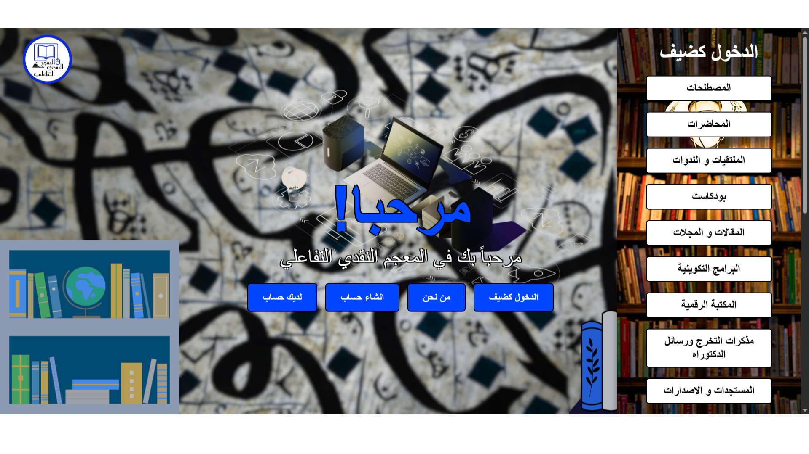

# Interactive Critical Dictionary

This is a modern recreation of the Arabic Language Platform using React, TypeScript, and Tailwind CSS.

المعجم النقدي التفاعلي هو مشروع رقمي يهدف إلى بناء قاعدة معرفية شاملة تجمع أبرز المصطلحات والمفاهيم النقدية في مجال الأدب والنقد، وتعرض بطريقة تفاعلية تمكّن المستخدم من البحث والمقارنة والاطلاع على الشروحات المتعددة للمصطلح الواحد. كما يقدّم ترجمة دقيقة لهذه المصطلحات باللغتين الفرنسية والإنجليزية، لتيسير التواصل المعرفي والانفتاح على الدراسات العالمية. يسعى المعجم إلى توضيح الفروق الدلالية بين المصطلحات، والحد من فوضى الاصطلاح وتضارب المعاني في البحوث الأكاديمية، إضافةً إلى تعزيز الوعي النقدي لدى الباحثين والطلبة، وتوفير أداة علمية دقيقة تواكب التحولات المعرفية الحديثة في الخطاب النقدي العربي.

Copyright (c) 2024 Alaa Younsi. All rights reserved.
